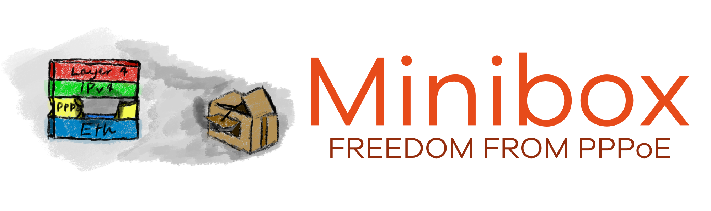

---

Minibox PPPoE Annihilator is a neat distribution of the most popular operating system that will completely annihilate the PPPoE protocol from your network/homelab. You will never again be forced to use your router's PPP implementation.

> Note! I am not an embedded systems programmer and am only learning. I take no responsibility for the operation of this project. Most of the features here are mainly for show. The project can serve as a basis for someone else to start playing with the embedded world. In fact, the very concept of this project could be implemented in OpenWrt or another system of this type.

### The Problem

Currently, many operators still provide their services using PPPoE. This relic of the past requires special packet encapsulation mechanisms, which is why operating system kernels often have dedicated network drivers to support this protocol. What does not have this support are network cards, which are currently equipped with very advanced queuing mechanisms that unfortunately do not recognise PPPoE traffic. Combined with the sometimes poor implementation of PPPoE in the operating systems of even the largest manufacturers of business/homelab/enterprise class routers, this results in scenarios such as 400Mbps download speeds on a speed test on a 2.5Gbps GPON connection. Then, after a ton of tinkering and tweaking in the deepest depths of the kernel, we get 600Mbps.

### The Solution

The Minibox PPPoE Annihilator is a solution to this problem that is several years overdue. It is the dream of many administrators who were forced to use PPPoE and wanted a simple solution – PPPoE goes in, IP comes out. That is exactly what Minibox is. A tiny Linux distribution containing the most important components. Its only task is to terminate the PPPoE session with your operator's Access Concentrator and then make the received IP address available to your router without PPPoE mediation. Minibox also deals with the MTU problem, which in the case of PPPoE is 1492 (8 bytes from the standard 1500 go to the PPP header) - in two ways: TCP MSS Clamping (what routers sometimes do) or Jumbo frames. Of course, the latter must be supported by the ISP, but it will probably do so for speeds above 1Gbps.

### On the LAN side

On the LAN interface side, Minibox is able to forward the received IP address in various ways. According to the standard (and name), the PPP protocol is a point-to-point network protocol. Where we are the *peer* side and the operator is the *remote* side. There is no concept of a subnet mask, network address, broadcast address, prefix, or other such concepts known from the classic TCP/IP stack. Of course, this raises some problems, because if we want to transfer the IP address to the LAN side using the classic TCP/IP stack, there must be some kind of mask. Unfortunately, devices have different implementations of the IP protocol, so Minibox allows you to set several subnet mask modes, which it then broadcasts using DHCP (it is possible to disable this):
- **Single /32 PPPoE host** - Minibox attempts to assign your router an IP address received from your operator, with a /32 mask - effectively a single host. It sends your operator's gateway IP address as the gateway. Of course, for ARP to work, it also implements proxyarp - but only for this gateway, so as not to overload the MAC table. It assigns itself an IP address completely out of the blue - this is configurable, of course, but it is not recommended to set an address from the private pool; by default, it is an IP from the address pool for documentation purposes. This mode is practically identical to how PPPoE works. Unfortunately, many operating systems do not like the /32 mask, or do not like it when the gateway address is outside the IP address pool (which will be the case).
- **Point-to-point /31 network** - Minibox creates a point-to-point network based on the RFC3021 standard with a /31 mask. It takes the IP address assigned by your operator as a base and calculates a second one for itself on that basis. For example, if your operator has provided you with the IP address 203.0.0.1, the minibox will assign itself the address 203.0.0.0/31. In this mode, the operator's gateway is not used for anything (PPP can cope without it - an interesting fact). The minibox assigns an address using DHCP with a /31 mask. From the perspective of our router, the gateway is therefore in the same subnet, but again, not all operating systems support the RFC3021 standard. For example, MikroTik RouterOS only introduced such support in version 7.18. The consequence of choosing this mode is the loss of connectivity with the neighbouring address. If the Minibox has assigned itself the address 203.0.0.0, it will treat it as its own and as local. So instead of our neighbour, the Minibox will respond. Unfortunately, this is a sacrifice that must be made in this mode, and it gets even worse.
- **Standard /30 network** and **Standard /24 network** - Minibox creates standard networks with /30 or /24 masks, depending on your selection. It also assigns itself an IP address based on the one received from the operator - this time from the entire pool. If the operator has assigned you the IP address 203.0.0.1, Minibox will create a local network 203.0.0.0/30 (or /24). It will assign itself the address 203.0.0.2/30 because the one ending with 0 is the network address (RFC3021 in the previous mode completely eliminated network and broadcast addresses). As you can see, the consequence of these modes is the loss of connectivity with three addresses (for /30) or 254 addresses (for /24), as the entire subnet will be treated as local. Fortunately, we very rarely need to connect to other subscribers of our operator.

The good news is that Windows, Linux and MikroTik RouterOS operating systems work well with the first mode.
PS. On Linux, you need to set up a peer-to-peer connection. `ip link addr add <our IP> peer <gateway IP> dev <interface>`
PSS. On MikroTik RouterOS, you need to enter our IP as the IP Address and the gateway address as the Network. `/ip/address add interface=<interface> address=<our IP> network=<gateway>`

### Additional useful features

Unfortunately, because Minibox operates in the third layer of the OSI model, it is visible in traceroute results. Therefore, a feature called **TTL Mangle** has been introduced, which increases the TTL of all packets passing through Minibox by 1, making Minibox virtually invisible in normal traffic. A similar trick is used to bypass tethering restrictions in mobile networks. Of course, since not everyone wants their packets to be modified, this is a completely optional feature (although enabled by default).

### Additional useless features

The Minibox can be configured classically from the shell (there is no SSH, so you either need to use a keyboard and monitor or set the output to a serial port) or via the web interface.

### Default login details (for the shell and WebUI)

`root/minibox`
The user database is shared between the shell and the web panel, so changing your password in one place will also change it in the other.

### Configuration using the shell

By default, Minibox is configured to display the image on the monitor screen. Therefore, if we install it on physical hardware, the easiest way to configure it is in this manner. However, most often we will want to install Minibox on smaller devices - MiniPC, NUC, old firewalls. In most of these cases, access to the monitor will be limited, and it is best to use the serial port. Configuration is mainly done in the `/etc/minibox.cfg` file:

- `USE_VLAN` - enables VLAN on the WAN interface (default: 0 - disabled)
- `VLAN_ID` - sets the VLAN ID (default: 1)
- `VLAN_PCP` - sets the VLAN priority (default: 0)
- `PPPOE_USER` - PPPoE user name
- `PPPOE_PASS` - PPPoE user password
- `PPPOE_SERVICE` - the so-called Service Name sometimes used by operators
- `PPPOE_MTU` - maximum MTU on the PPPoE interface (default: 1492)
- `PPPOE_MAC` - MAC address of the WAN interface, if the operator uses a whitelist (default empty, i.e. MAC unchanged)
- `LAN_MASK` - subnet mask used on the LAN interface; although I previously wrote about four modes, here you can enter any value in the range `1-32` (default: 32)
- `LAN_IP` - the IP address that Minibox will assign itself if the mask is set to 32 (default: 203.0.113.113)
- `LAN_DHCP` - enables the DHCP server on the LAN interface (default: 1 - enabled)
- `LAN_LEASE` - lease time of our IP address in seconds, the shorter the better if we have a dynamic IP (default: 60 seconds)
- `MANGLE_TTL` - enables TTL Mangle functionality (default: 1 - enabled)

The `/etc/minibox.static` file contains static configuration specific to a given system. Edit it only when you want to change the default IP from 192.168.77.1/24 or when you want to change the interface assignment.

Each change to the settings requires a reboot (and a quick one if you edit the minibox.cfg file on the fly, which is not recommended). It is much safer to create the `/etc/minibox.cfg.new` file and enter the settings there. Minibox will apply it automatically upon reboot.

#### Setting up access via the serial port

By default, the Limine bootloader is visible both on the monitor and on the serial port. Therefore, without connecting a monitor, we can access the bootloader:

1. After entering the bootloader menu, press the **E** button
2. Find the `cmdline` line and add `console=ttyS0,115200` to it. For more embedded devices, `ttyS0` may have a different name.
3. Press F10. The system should boot up and you should see the login screen

### Configuration using a web browser

The Minibox has a built-in HTTP server through which it can be configured. The default IP address on the LAN side is `192.168.77.1/24` (the DHCP server is **NOT** working). However, it is worth bearing in mind that when we correctly configure the PPPoE client and it establishes a session, the IP address of the LAN interface will change. The simplest case is with a /32 mask, because then we can set any IP address (without a mask). For other modes, the address is selected based on the one assigned by the operator (usually the first available one).

Configuration via a browser is the recommended method, as WebAPI and internal scripts ensure that no damage occurs. The interface shown in the image below is very clear and equipped with additional help features.

### Available images:
- `<data>-minibox-generic-x86_64.img.xz` - contains most gigabit network card drivers, disk controllers and mass storage devices. It is intended for general use.
- `<data>-minibox-qemu-x86_64.img.xz` - contains only drivers used in the QEMU environment. A smaller version intended for virtualisation.

### Image installation

Minibox does not have any fancy installers, as it is such a simple system that all you need to do is burn it with Rufus/dd/balenaEtcher to a disk/USB stick/SD card and boot it. The images are prepared to work with both BIOS and UEFI (although there is no support for Secure Boot).

## Building your own image

The repository has been equipped with useful scripts that support the process of building your own image. The whole thing is based on the excellent Buildroot system, which also facilitates potential modifications.

Before we start working with the repository, we need to download all git submodules (that is why it is best to clone the Minibox repo rather than download zip/tar), which can be done with the command `git submodule update --init`. Then, using the appropriate scripts, we call individual functions:

- `busybox-menuconfig.sh` - opens the Busybox configuration menu for the currently selected configuration profile
- `clear_build.sh` - completely clears Buildroot and restores it to its original state
- `linux-menuconfig.sh` - opens the Linux kernel configuration menu for the currently selected configuration profile
- `menuconfig.sh` - opens the Buildroot configuration menu for the currently selected configuration profile
- `rebuild_and_install_external_packages.sh` - recompiles all external packages
- `save_busybox_linux_config.sh` - saves the Busybox and Linux kernel configuration permanently (outside the Buildroot directory)
- `save_defconfig.sh <configuration name>` - saves the Buildroot configuration profile permanently (outside the Buildroot directory)
- `set_defconfig.sh <configuration name>` - changes the currently selected Buildroot configuration profile

For example, to build a generic image step by step, you need to:
1. Initialise git submodules: `git submodule update --init`
2. Set the configuration profile to minibox-generic: `./set_defconfig.sh minibox-generic`
3. Build everything with the command `make -C buildroot`

The resulting image will be in the `buildroot/output/images` directory.

I leave the rest, i.e. how the project works, for you to explore on your own.

## Licensing issues

The Minibox PPPoE Annihilator itself and all of its components authored by me (i.e. effectively the entire repository) are available under the MIT licence. However, in order to distribute it, you must also include information about the other components that are included in the final image.

Components of the final image:
*   Busybox - GPLv2 - [https://busybox.net/](https://busybox.net/)
*   linux - GPL-2.0 WITH linux-syscall-note - [https://www.kernel.org/](https://www.kernel.org/)
*   musl - MIT License - [http://musl.libc.org](http://musl.libc.org)
*   pppd - BSD-style / GPLv2+ - [https://ppp.samba.org/](https://ppp.samba.org/)
*   Limine Bootloader - BSD-2-Clause - [https://github.com/limine-bootloader/limine](https://github.com/limine-bootloader/limine)
*   nftables - GPLv2+ - [https://www.netfilter.org/projects/nftables](https://www.netfilter.org/projects/nftables)
*   libmnl - LGPLv2.1+ - [https://netfilter.org/projects/libmnl](https://netfilter.org/projects/libmnl)
*   libnftnl - GPLv2+ - [https://netfilter.org/projects/libnftnl/](https://netfilter.org/projects/libnftnl/)
*   alpine.js - MIT License - [https://alpinejs.dev](https://alpinejs.dev)
*   alpinejs-i18n - MIT License - [https://github.com/rehhouari/alpinejs-i18n](https://github.com/rehhouari/alpinejs-i18n)
*   picocss - MIT License - [https://picocss.com/](https://picocss.com/)
*   Bootstrap Icons - MIT License - [https://icons.getbootstrap.com/](https://icons.getbootstrap.com/)

The **webapi** CGI program uses these components:
* cJSON - MIT License - [https://github.com/DaveGamble/cJSON](https://github.com/DaveGamble/cJSON)
* monocypher - BSD-2-Clause - [https://monocypher.org/](https://monocypher.org/)
* b64.c - MIT License - [https://github.com/jwerle/b64.c](https://github.com/jwerle/b64.c)

The repository was built based on [https://github.com/moschiel/buildroot_external_example](https://github.com/moschiel/buildroot_external_example).

I owe the idea for the project to users of many forums and my imagination.
The idea for the WebAPI was borrowed from the API by [SoftAtHome](https://www.softathome.com/), which was included in my ISP's router.
The idea for the help section on the right side of the WebUI was borrowed from the UI by [SoftAtHome](https://www.softathome.com/), which was included in my ISP's router.

And I'm sure I was inspired by many things that I've already forgotten, for which I am grateful.
